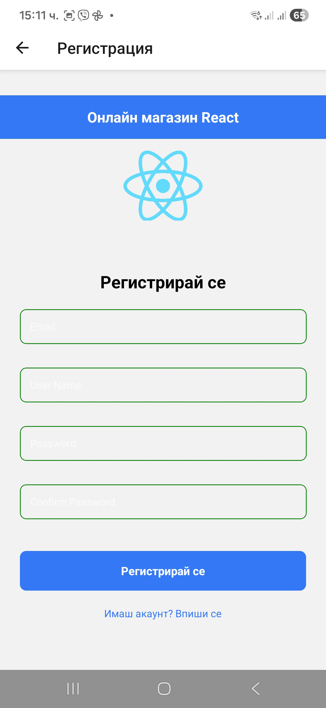
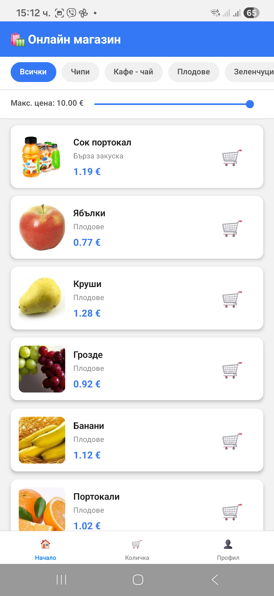
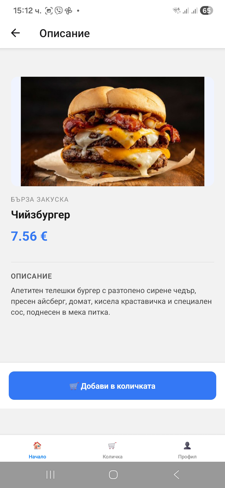
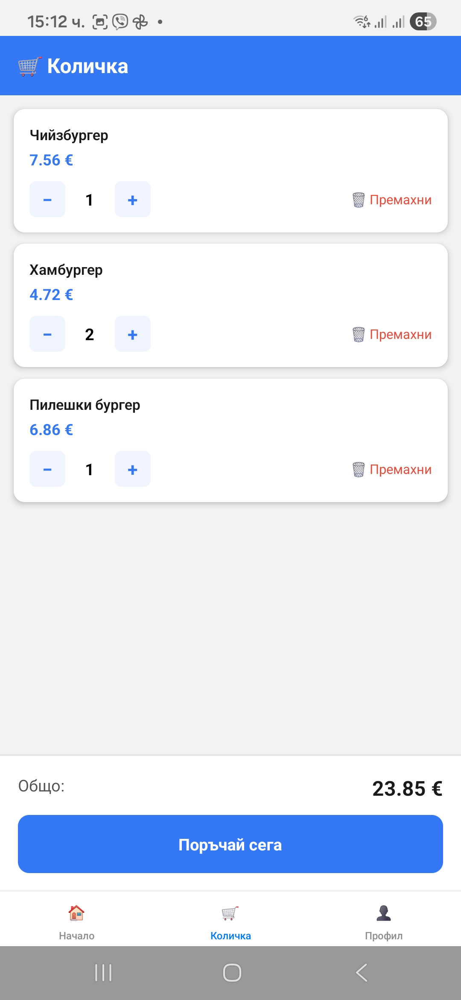
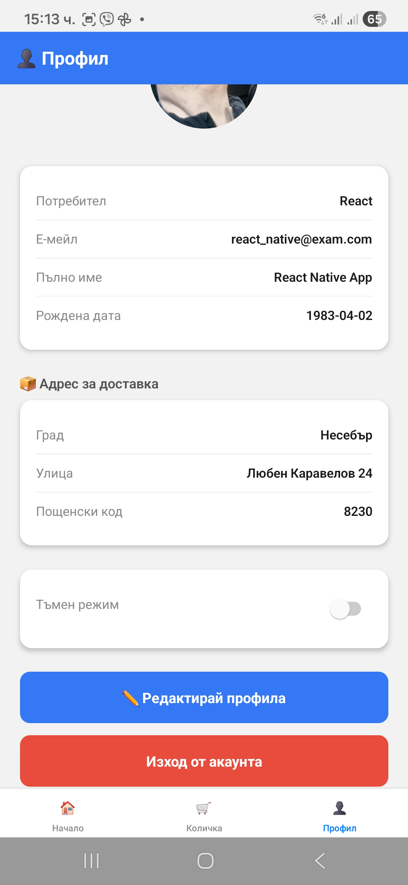
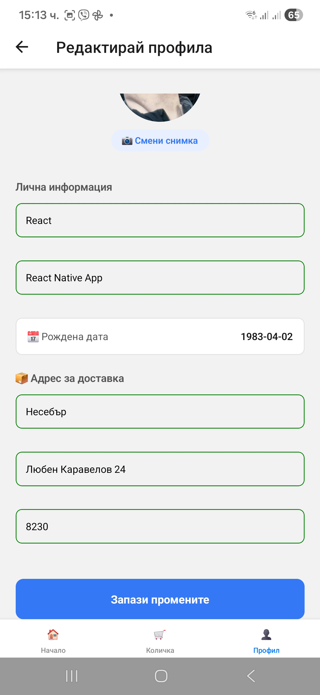

# 🛍️ E-Shop Mobile App

React Native курсов проект за мобилно приложение за онлайн магазин.

---

## 📦 APK Линк

```
🤖 Android app:
https://drive.google.com/file/d/1ClW2UsNtuF9S_O5c3_gMDQZD1U1c1G9S/view?usp=sharing
```

Или:
```
🤖 Android app:
https://expo.dev/artifacts/eas/83DTVM4PTB1HPSLVssGwQJ.apk
```

---

---

## 🔑 Тестови Данни за Вход

За да тествате приложението **без необходимост от регистрация**, използвайте следните credentials:

| Поле | Стойност |
|------|----------|
| **Email** | `react_native@exam.com` |
| **Password** | `111111` |

> **Забележка:** Този акаунт е предварително създаден и съдържа примерни данни за тестване на всички функционалности (профил, количка, и т.н.).

**Алтернатива:** Можете да използвате **"Продължи като гост"** за бързо разглеждане на продуктите (без достъп до Cart и Profile).

---

## 🚀 Инструкции за Инсталация

### Предварителни Изисквания

- Node.js (v18 или по-нова версия)
- npm или yarn
- Expo Go приложение (за тестване на физическо устройство)
- Android Studio или Xcode (опционално, за емулатор)

### Стъпки за Инсталация

1. **Клонирай репозиторито:**
```bash
   git clone https://github.com/venelinkolev/react-native-exam-2026.git
   cd react-native-exam-2026
```

2. **Инсталирай зависимостите:**
```bash
   npm install
```

3. **Създай `local.environment.ts` файл:**
   
   Копирай `local.environment.example.ts` и преименувай на `local.environment.ts`:
```bash
   cp local.environment.example.ts local.environment.ts
```
   
   Попълни с твоите Firebase credentials и API данни.

4. **Стартирай приложението:**
```bash
   npm start
```

5. **Тествай на устройство:**
   - Сканирай QR кода с **Expo Go** приложението (Android/iOS)
   - Или натисни `a` за Android емулатор / `i` за iOS симулатор

---

## 📱 Walkthrough - Как да използваш приложението

### За Guest потребители:
1. На началния екран избери **"Продължи като гост"**
2. Разглеждай продуктите на Home екрана
3. Филтрирай по категория и ценови диапазон
4. Натисни на продукт за детайли
5. **Не можеш** да добавяш в количка или да достъпваш профил

### За регистрирани потребители:
1. Натисни **"Регистрирай се"** и попълни формата
2. Влез с имейл и парола
3. Разглеждай и добавяй продукти в количката
4. Управлявай количката (промяна на количество, изтриване)
5. Редактирай профила си (име, avatar снимка, дата на раждане)
6. Включи/изключи Dark Mode от Profile екрана

---

## 📋 Functional Guide

### 1️⃣ Project Overview

- **Application Name:** E-Shop Mobile App
- **Application Category:** E-Commerce / Shopping
- **Main Purpose:**  
  Мобилно приложение за онлайн магазин, което позволява на потребителите да разглеждат продукти, да ги филтрират по категория и цена, да добавят продукти в количка и да управляват своя профил. Приложението поддържа както регистрирани потребители (с пълна функционалност), така и guest режим (само разглеждане на продукти).

---

### 2️⃣ User Access & Permissions

#### **Guest (Not Authenticated)**

Неавторизиран потребител има достъп до:
- ✅ **Home Screen** - разглеждане на продукти
- ✅ **Филтриране** по категория и цена
- ✅ **Product Details Screen** - детайли за продукт
- ❌ **Няма достъп** до Cart и Profile екраните
- При опит за достъп до Cart/Profile се показва съобщение "Моля, влез в акаунта си"

#### **Authenticated User**

Логнат потребител има достъп до:
- ✅ **Home Tab:**
  - Преглед на продукти с филтри (категория, цена)
  - Product Details Screen с възможност за добавяне в количка
- ✅ **Cart Tab:**
  - Преглед на добавените продукти
  - Промяна на количество (увеличаване/намаляване)
  - Изтриване на артикули
  - Преглед на обща цена
- ✅ **Profile Tab:**
  - Преглед на профилна информация (username, email, пълно име, дата на раждане)
  - Редактиране на профил (Edit Profile Screen)
  - Качване/смяна на профилна снимка чрез ImagePicker
  - Включване/изключване на Dark Mode
  - Logout функционалност

---

### 3️⃣ Authentication & Session Handling

#### **Authentication Flow**

**При стартиране на приложението:**
1. Приложението проверява дали има запазен **Firebase Auth Token** в SecureStore
2. Проверява се и дали има **API Session Token** и **Session ID**
3. Ако токените са валидни → потребителят се насочва директно към **Main App** (автоматичен login)
4. Ако няма токени → потребителят вижда **Auth Stack** (Login/Register екрани)

**При успешен Login:**
1. Потребителят въвежда имейл и парола
2. Firebase Authentication валидира данните
3. При успех се генерира **Firebase Auth Token**
4. Извиква се API endpoint `/login` за получаване на **API Session Token**
5. Генерира се уникален **Session ID** (UUID)
6. Всички токени се записват в **Expo SecureStore**
7. Потребителят се пренасочва към **Main App** (Bottom Tab Navigator)

**При регистрация:**
1. Потребителят попълва формата (имейл, парола, потвърждение на парола)
2. React Hook Form валидира данните
3. Firebase Authentication създава нов акаунт
4. Автоматично се логва и пренасочва към Main App
5. В Firebase Realtime Database се създава празен профил за потребителя

**При Logout:**
1. Изтриват се токените от SecureStore
2. Firebase Auth се logout-ва
3. Потребителят се пренасочва към **Auth Stack** (Login екран)

#### **Session Persistence**

- **Как се пази сесията:**  
  Потребителската сесия се съхранява чрез **Expo SecureStore** (криптирано хранилище).  
  Записват се:
  - `firebaseAuthToken` - Firebase authentication token
  - `apiToken` - API session token за е-shop backend
  - `sessionID` - UUID за cart операции
  
- **Auto-login след рестартиране:**  
  При всяко стартиране на приложението, `AuthContext` проверява SecureStore за запазени токени. Ако токените са валидни, потребителят автоматично се логва без да въвежда отново credentials.

---

### 4️⃣ Navigation Structure

#### **Root Navigation Logic**

Навигацията е разделена на два основни flow-а:

- **Ако потребителят НЕ е логнат:**  
  Показва се **Auth Stack** (Login / Register екрани)
  
- **Ако потребителят Е логнат:**  
  Показва се **Main App** с Bottom Tab Navigator

- **Guest Mode:**  
  Потребител може да избере "Продължи като гост" и да разглежда продукти без регистрация, но с ограничен достъп (без Cart и Profile).

#### **Main Navigation**

Приложението използва **Bottom Tab Navigator** с 3 таба:

1. **🏠 Home Tab** (Stack Navigator)
   - HomeScreen (списък с продукти)
   - ProductDetailsScreen (детайли за продукт)

2. **🛒 Cart Tab**
   - CartScreen (количка с продукти)

3. **👤 Profile Tab** (Stack Navigator)
   - ProfileScreen (преглед на профил)
   - EditProfileScreen (редактиране на профил)

#### **Nested Navigation**

✅ **Да, има вложена навигация:**

- **Home Tab** съдържа **Stack Navigator**:
  - `HomeScreen` → `ProductDetailsScreen`
  
- **Profile Tab** съдържа **Stack Navigator**:
  - `ProfileScreen` → `EditProfileScreen`

---

### 5️⃣ List → Details Flow

#### **List / Overview Screen**

**HomeScreen** показва:
- **FlatList** със списък от продукти
- Всеки продукт се рендира чрез `ProductCard` компонент
- Потребителят може да:
  - Филтрира продуктите по **категория** (чрез хоризонтални бутони)
  - Филтрира по **максимална цена** (чрез Slider компонент)
  - **Pull-to-refresh** за презареждане на продуктите
  - Натисне на продукт за детайли

#### **Details Screen**

**ProductDetailsScreen:**
- Навигацията се задейства при **натискане** на `ProductCard` компонента
- **Данните** се предават чрез **route parameters:**
```typescript
  navigation.navigate("ProductDetails", { product });
```
- Екранът получава целия `product` обект и показва:
  - Име на продукта
  - Снимка (base64 image)
  - Цена
  - Описание
  - **"Добави в количка"** бутон (само за логнати потребители)

---

### 6️⃣ Data Source & Backend

#### **Backend Type**

✅ **Real Backend:**

Приложението използва **Firebase** за:
- **Firebase Authentication** - за login/register
- **Firebase Realtime Database** - за user profiles
- **Firebase Storage** - за avatar снимки

И **REST API** за:
- **E-Shop API** (`https://api3.eyanak.com:1110/e-shop/api`)
  - `/login` - за API session token
  - `/getstockslite` - за продукти
  - `/cart` - за CRUD операции с количката

---

### 7️⃣ Data Operations (CRUD)

#### **Read (GET)**

1. **GET Products** (`/getstockslite`)
   - **Къде:** HomeScreen
   - Зарежда списък с продукти от API
   - Показва ги във FlatList с pull-to-refresh

2. **GET Cart** (`/cart`)
   - **Къде:** CartScreen
   - Зарежда текущите артикули в количката на потребителя
   - Използва `sessionID` за идентификация

3. **GET User Profile** (Firebase Realtime Database)
   - **Къде:** ProfileScreen
   - Зарежда username, fullName, birthdate от Firebase

4. **GET Avatar** (Firebase Storage)
   - **Къде:** ProfileScreen
   - Зарежда URL на профилната снимка

#### **Create (POST)**

1. **POST Add to Cart** (`/cart`)
   - **Къде:** ProductDetailsScreen
   - Потребителят натиска "Добави в количка"
   - Изпраща `stockID`, `quantity`, `sessionID`
   - При успех се показва Alert "Продуктът е добавен в количката"

2. **POST Register User** (Firebase Auth)
   - **Къде:** Register Screen
   - Създава нов потребител във Firebase Authentication
   - Автоматично създава празен профил в Realtime Database

#### **Update (PUT)**

1. **PUT Update Cart Quantity** (`/cart`)
   - **Къде:** CartScreen
   - Потребителят променя количеството на артикул (+/-)
   - Изпраща новото `quantity` и `cart item id`
   - UI се обновява автоматично след успешна заявка

2. **PUT Update User Profile** (Firebase Realtime Database)
   - **Къде:** EditProfileScreen
   - Потребителят редактира username, fullName, birthdate
   - Данните се обновяват в Firebase
   - ProfileScreen се презарежда автоматично

3. **PUT Upload Avatar** (Firebase Storage)
   - **Къде:** EditProfileScreen
   - Потребителят избира снимка чрез **Expo ImagePicker**
   - Снимката се качва в Firebase Storage
   - URL-ът се записва в Realtime Database

#### **Delete (DELETE)**

1. **DELETE Cart Item** (`/cart`)
   - **Къде:** CartScreen
   - Потребителят натиска бутон "Изтрий"
   - Изпраща `cart item id`
   - Артикулът се премахва от количката
   - UI се обновява след успешно изтриване

---

### 8️⃣ Forms & Validation

#### **Forms Used**

1. **Login Form** (Login.tsx)
2. **Register Form** (Register.tsx)
3. **Edit Profile Form** (EditProfileScreen.tsx)

#### **Validation Rules**

Използва се **React Hook Form** за всички форми.

**Login Form:**
- **Email:**
  - ✅ Required (задължително поле)
  - ✅ Email format (валиден имейл формат)
- **Password:**
  - ✅ Required (задължително поле)

**Register Form:**
- **Email:**
  - ✅ Required
  - ✅ Email format
- **Password:**
  - ✅ Required
  - ✅ Minimum 6 characters (минимум 6 символа)
- **Confirm Password:**
  - ✅ Required
  - ✅ Must match password (трябва да съвпада с паролата)

**Edit Profile Form:**
- **Username:**
  - ✅ Required
  - ✅ Minimum 3 characters
- **Full Name:**
  - ✅ Required
- **Birth Date:**
  - ✅ Optional (но се валидира формата, ако е попълнена)

---

### 9️⃣ Native Device Features

#### **Used Native Feature(s)**

✅ **Camera / Image Picker** (Expo ImagePicker)

#### **Usage Description**

- **Къде се използва:**  
  **ProfileScreen** и **EditProfileScreen**

- **Функционалност:**
  1. Потребителят отваря Profile екрана
  2. Натиска бутон "Редактирай профила"
  3. В EditProfileScreen има бутон "Избери снимка"
  4. **Expo ImagePicker** отваря галерията на устройството
  5. Потребителят избира снимка
  6. Снимката се качва в **Firebase Storage**
  7. URL-ът на снимката се записва в **Firebase Realtime Database**
  8. Профилната снимка се показва на ProfileScreen

- **Permissions:**  
  Приложението изисква разрешение за достъп до галерията (photos permission).

---

### 🔟 Typical User Flow

**Типичен сценарий за регистриран потребител:**

1. **Потребителят стартира приложението**
   - Ако е логнат преди → автоматичен login
   - Ако не → вижда Login екран

2. **Потребителят се логва или регистрира**
   - Въвежда имейл и парола
   - Натиска "Влез" или "Регистрирай се"

3. **Разглежда продукти на Home екрана**
   - Филтрира по категория (напр. "Електроника")
   - Променя ценовия филтър с Slider
   - Вижда списък с продукти

4. **Отваря детайли за продукт**
   - Натиска на ProductCard
   - Вижда пълна информация
   - Натиска "Добави в количка"

5. **Отива в Cart екрана**
   - Вижда добавените продукти
   - Променя количеството (+/-)
   - Изтрива ненужни артикули

6. **Редактира профила си**
   - Отива в Profile екран
   - Натиска "Редактирай профила"
   - Качва профилна снимка
   - Променя пълното си име
   - Записва промените

7. **Logout**
   - Натиска "Излез" на Profile екрана
   - Връща се към Login екран

---

### 1️⃣1️⃣ Error & Edge Case Handling

#### **Authentication Errors**

- При грешен имейл/парола → Alert със съобщение "Грешен имейл или парола"
- При празни полета → Показва се error под полето чрез React Hook Form
- При слаба интернет връзка → "Проблем с мрежата, опитайте отново"

#### **Network or Data Errors**

- **При зареждане на продукти:**
  - Показва се `ActivityIndicator` (loading spinner)
  - При грешка → "Грешка при зареждане на продуктите"
  - Бутон "Опитай отново" за повторна заявка

- **При CRUD операции с количката:**
  - Всяка API заявка е обвита в `try/catch`
  - При грешка → Alert с информативно съобщение
  - При успех → UI се обновява автоматично

#### **Empty or Missing Data States**

- **Празна количка:**
  - Показва се съобщение "Количката е празна"

- **Няма продукти (след филтриране):**
  - "Няма налични продукти."

- **Guest режим:**
  - При опит за достъп до Cart/Profile → "Моля, влез в акаунта си" и бутон **"Към вход"**

- **Липсваща профилна снимка:**
  - Показва се placeholder avatar (икона за потребител)

---

## 🛠️ Tech Stack

- **Framework:** React Native (Expo)
- **Language:** TypeScript
- **Navigation:** React Navigation (Stack + Bottom Tabs)
- **State Management:** Context API (AuthContext, CartContext, ThemeContext)
- **Backend:** 
  - Firebase (Authentication, Realtime Database, Storage)
  - REST API (E-Shop API)
- **Forms:** React Hook Form
- **Native Features:** Expo ImagePicker, Expo SecureStore
- **UI Components:** React Native Community Slider, DateTimePicker

---

## 📊 Project Structure
```
src/
├── api/              # API calls (auth, products, cart)
├── context/          # Global state (Auth, Cart, Theme)
├── hooks/            # Custom hooks
├── navigation/       # Navigation structure
├── screens/          # All screens (auth, home, cart, profile, guest)
├── services/         # Business logic (userProfile service)
├── shared/           # Reusable components (ProductCard, InputField, etc.)
├── types/            # TypeScript interfaces
└── utils/            # Helper functions (storage, validators)
```

---

## 📸 Screenshots

<p align="center">
  
  
  
  
</p>
<p align="center">
  
  
  
</p>

---

## 👨‍💻 Author

**Венелин Колев**  
React Native Course 2026  
SoftUni

---

## 📄 License

This project is licensed under the MIT License.